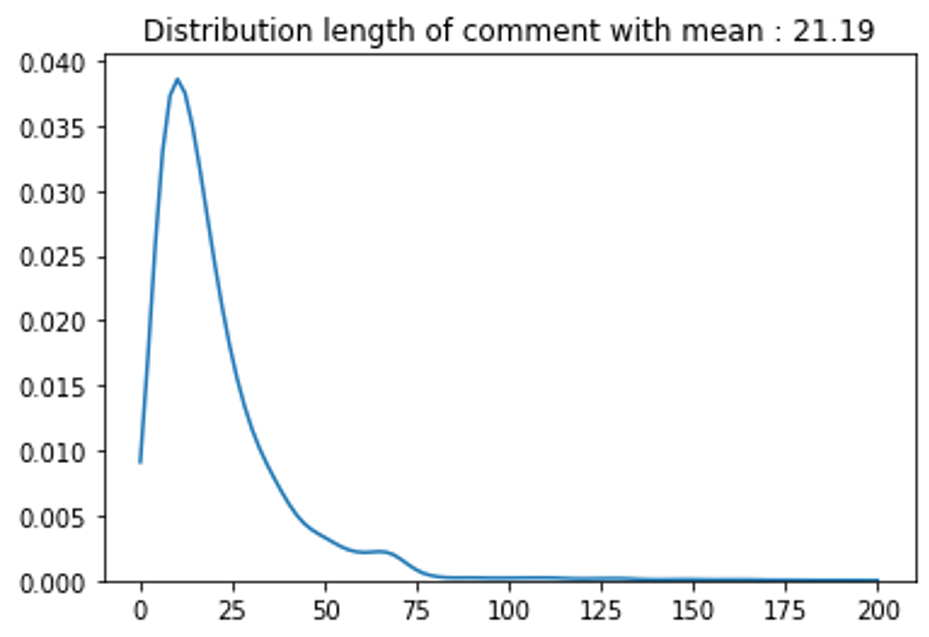
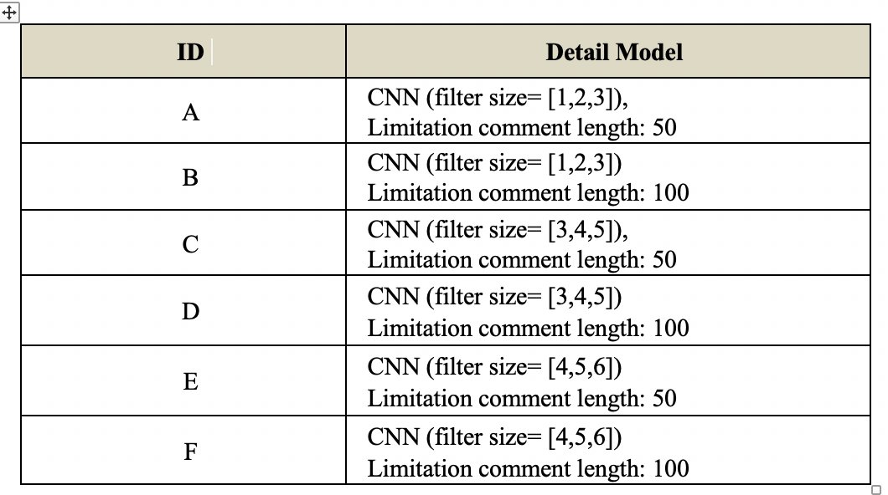
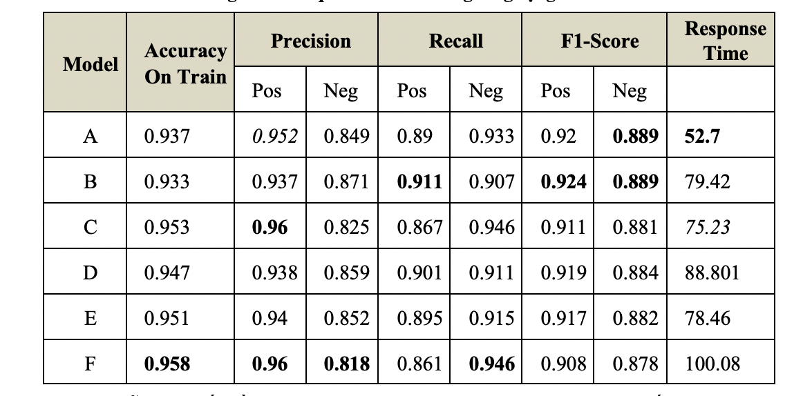
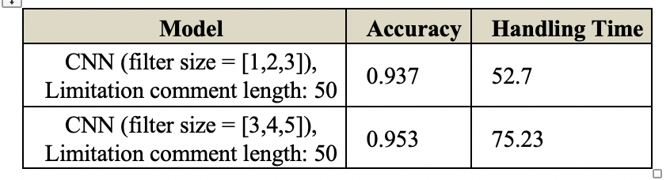
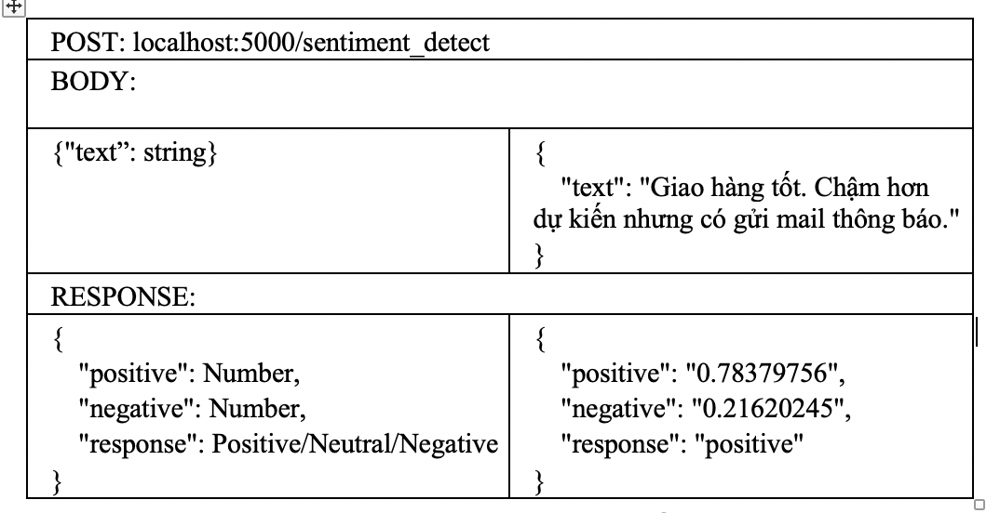

# Sentiment Analytics
The purpose of this repository is to explore sentiment analytics methods in NLP with CNN.

## Table of Contents

- [Introduction](#introduction)
- [Data](#data)
- [Preporcessing](#preprocessing)
- [Training](#training)
- [Result](#result)
- [Conclusion](#conclusion)
- [Deploy](#deploy)
- [References](#references)
## Introduction

This is our research in 3 months for thesis in order to build a sentiment module. This module will play an important role which classify sentiment of comments. Overview, it's a part of our social listening thesis.

## Data

The data from VLSP2016 contains user's reviews following two categories: "positive" and "negative".

27068 sentences

- Train: 16087 sentences, Test: 10981 sentences (public: 5454 sentences, private: 5527 sentences)
- Labels: 0 (positive), 1 (negative)

Read [here](https://vlsp.org.vn/vlsp2016/eval/sa) for more information.

## Preprocessing
### Clearning
16087 comments which is labeled pos and neg.

|	|Positive|	Negative|
| ------------- |:-------------:| -----:|
|   |	9280	|6807|
|Tổng cộng|	57%	|43%|

This data is balanced between 2 labels, therefore It's qualification for learning model.
### Word Embedding
We used 2 word2vec libraries:
- word2vec from SonVX [link](https://github.com/sonvx/word2vecVN).
    - Model trained on Le et al.'s data (window-size 5, 400 dims)
    - Model trained on Le et al.'s data (window-size 2, 300 dims)

- emoj2vec from uclnlp [link](https://github.com/uclnlp/emoji2vec).

After merging fomr 2 dictionaries, we got a new dictionary with 440717 words.
### Tokenizer
- For Zero padding with short comment, we added <b>UNKNOWN</b> relatively vector <b>ZERO</b>.
- The length of vector is determined by the most covered training set. 

With length equals 50, We coverd 92.89% training set. However, we will test for both lenghth of 50 and 100.
## Training
 We refer 2 famouse paper:
 - Convolutional neural network architecture from Kim (2014)[1].
 - Twitter Sentiment Analysis with CNNs and LSTMs Mathieu Cliche (2017)[2].

 We trained 6 models with diffrent hypeparameter.
 


## Result

 

It is evident that using CNN model with filter_size [4, 5, 6] for 100 comments yield the highest score but is also takes the most time. 

On the other hand, using CNN model with filter_size [1, 2, 3] of length only takes a rather short time with <b>52.7 </b>seconds for 10981 comments which is quicker than other models. Additionally, while having a precision (negative) of 0.849 and nearly highest precision (positive), its accuracy is higher than 90%.
For other models, there are no noticable differences in terms of accuracy and process time.
## Conclusion

 
With the goal of building a model for social media realtime processing in mind, we take processing time into account most to decide which model to choose. However, to be more objective, we decided to include a CNN model with filter size = [3, 4, 5] with 50 in length, which have a high precision score of 0.953 and process time of 75.23 seconds, in the performance test to choose the model with the best response time.
## Deploy
### Enviroment 
- python 3.5+
- tensorflow 2.0.1
- Flask
### Server configure
Ubuntu 14.04 4GB RAM CPU 2 Core
### Running
Port : 5000
```python
python app.py
```
### Payload
 
## References
[1] Yoon Kim (2014). “Convolutional neural networks for sentence classification”. published at Association for Computational Linguistics (ACL).

[2] Mathieu Cliche. “Twitter Sentiment Analysis with CNNs and LSTMs”. ClicheBB twtr at SemEval-2017 Task 4 published at Association for Computational Linguistics (ACL) page 573-580.
